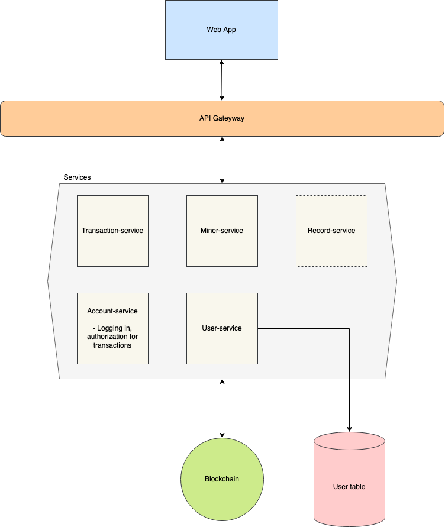

# BisonCoin

Repo containing documents and code for our COMP 4350 Group Project.

## Members

- Abhi Sachdev ([GitHub](https://github.com/abhisachdev17))
- Madison Fines ([GitHub](https://github.com/madisonfines))
- Akshay Sharma ([GitHub](https://github.com/akshaysharma21))
- Zack Holmberg ([GitHub](https://github.com/ZackHolmberg))

## Project Description

- BisonCoin is a new cryptocurrency intended for use by University of Manitoba students to exchange on campus between each other or a variety of products at all campus businesses, including all food outlets and the book store!

- The system will be composed of:
  - A front-end web application
  - A collection of microservices
  - A Blockchain, cryptocurrency implementation
  - Data storage, if needed

## Core Features

- With the BisonCoin app, students will be able to send and receive to their peers, as well as businesses in order to purchase products.
- Students will be able to use the app to view how much BisonCoin they have in their digital wallet, as well as view their transaction history.
- Students will be able to act as miners on the blockchain network, earning currency as a reward.

## Tech Stack

- **Blockchian:** `Python`
- **Micro-servies:** `Python`
- **Front-end Web app:** `Vue.js, Node.js or Flask` (TBD)
- **Data Storage:** `MongoDB`, if needed

## Architecture Diagram

